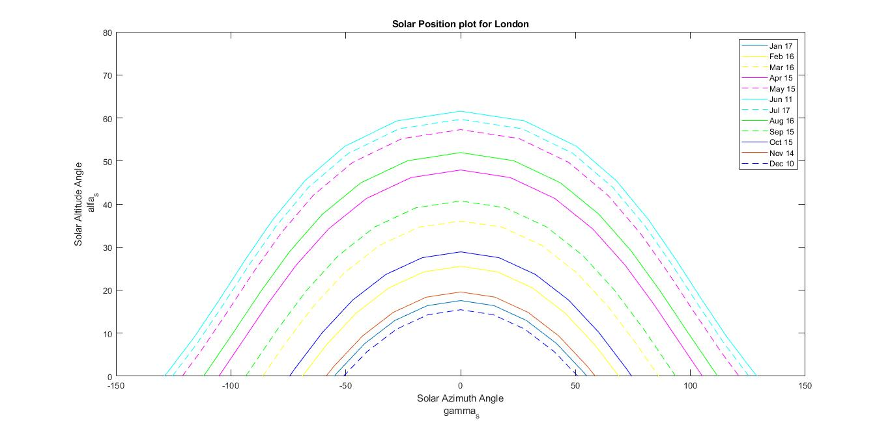

# Solar Position Model in MATLAB

A MATLAB implementation for calculating solar geometry and solar-time parameters for London over a complete year.

## Overview

This code was developed to calculate the variation of solar position and daylight parameters throughout the year using standard solar-geometry equations. The model calculates daily solar-time parameters for 365 days and generates solar-path curves for representative days of each month.

## Calculated Parameters

The MATLAB model calculates:

- Solar declination angle
- Sunset hour angle
- Sunrise and sunset times
- Daylight duration
- Equation of time
- Solar-time correction
- Solar noon
- Solar altitude angle
- Solar zenith angle
- Solar azimuth angle

## Method

The daily solar declination and sunset hour angle are calculated from the day of the year and geographical latitude. These values are used to determine sunrise, sunset and daylight duration.

The equation of time and longitude correction are then used to account for the difference between solar time and local standard time.

For representative days of each month, the code calculates solar altitude, zenith and azimuth angles between sunrise and sunset. These results are used to generate the annual solar-path diagram.

## Example Result

The figure below shows the calculated solar paths for London for representative days throughout the year.

## Tools

- MATLAB
- Numerical implementation of solar-geometry equations
- Data processing and visualisation

## Author

Samira Nazari
